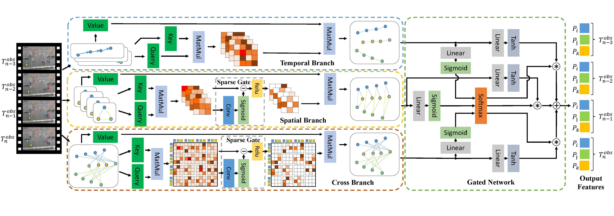
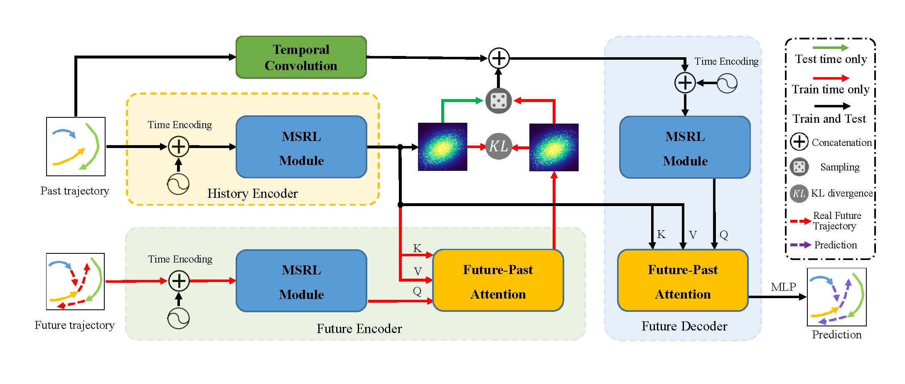

# Multi-Stream Representation Learning for Pedestrian Trajectory Prediction
Official code for AAAI 2023 paper "[Multi-Stream Representation Learning for Pedestrian Trajectory Prediction](https://drive.google.com/file/d/1ZrHmC00bOAuKaXuEmJbqWgLjt89yixsV/view?usp=drive_link)"

# Framework

## Multi-stream Representation Learning
<div align='center'>
</img>
</div>
<br />

## CVAE for Multi-modal Prediction
<div align='center'>
</img>
</div>
<br />

[//]: # (Coming soon.)

# Installation


## Environment

* Tested OS: Ubuntu 18.04 LTS / RTX3090

* Python >= 3.7

* PyTorch == 1.8.0


## Dependencies

1. Install [PyTorch 1.8.0](https://pytorch.org/get-started/previous-versions/) with the correct CUDA version.

2. Install the dependencies:

    ```
    pip install -r requirements.txt
    ```


# Evaluation

Download the pre-trained models from [GoogleDrive](https://drive.google.com/file/d/11zNG_QMD8oXQwx46S6FY2z5Hqsnmh7rD/view?usp=sharing). Then unzip and put it under the project folder.

Run the following and then you will be able to reproduce the main results in our paper. 

<dataset_name> can be eth, hotel, univ, zara1, zara2 or sdd.

```
python test.py --dataset <dataset_name> --gpu <gpu_id>
```


# Training

This model requires **two-stage** training.

1. Train the Multi-stream Representation Learning based CVAE model

    ```
    python trainvae.py --dataset <dataset_name> --gpu <gpu_id>
    ```

2. Train the sampler model

    ```
    python trainsampler.py --dataset <dataset_name> --gpu <gpu_id>
    ```

You can modify the configuration by giving different parameters.


# Acknowledgement

Thanks for the ETH-UCY data processing from [SGCN](https://github.com/shuaishiliu/SGCN) and SDD data provided by [PECNet](https://github.com/j2k0618/PECNet_nuScenes).


# Citation

If you find this repo helpful, please consider citing our paper

```
@inproceedings{wu2023multi,
  title={Multi-stream representation learning for pedestrian trajectory prediction},
  author={Wu, Yuxuan and Wang, Le and Zhou, Sanping and Duan, Jinghai and Hua, Gang and Tang, Wei},
  booktitle={Proceedings of the AAAI Conference on Artificial Intelligence},
  volume={37},
  number={3},
  pages={2875--2882},
  year={2023}
}
```
